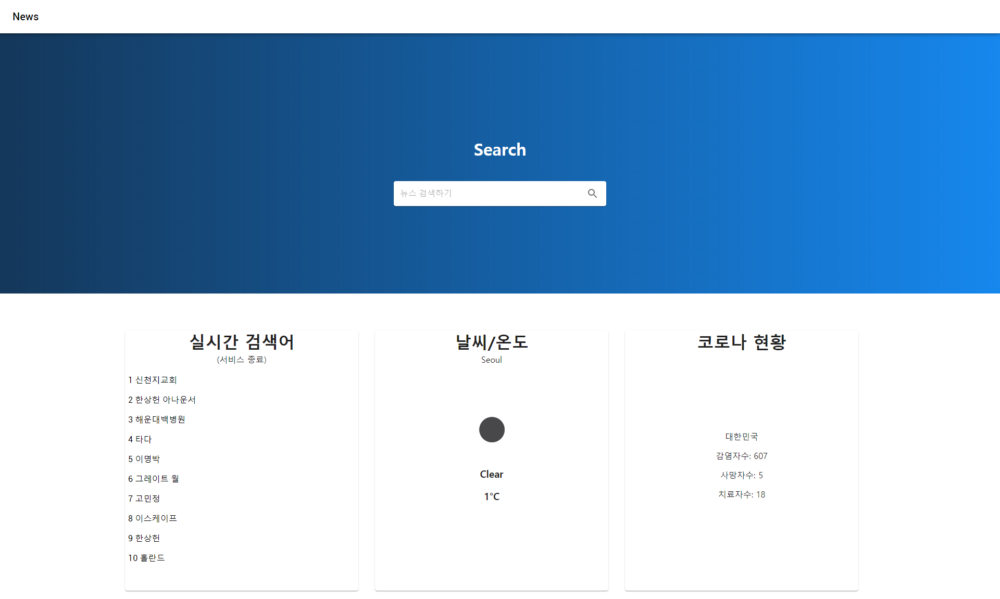

# TodayArticle


뉴스 검색 기능 및 여러가지 편의 기능을 제공하는 사이트 

## 
[사이트 보기]("https://tonews.netlify.com/")

## 사용 방법 (Usage)

```console
npm install
node app.js //start API server

cd client
npm run build
serve -s build
```

## API server

네이버 랭킹 및 네이버 기사 크롤링 <br>
날씨api를 사용,위키에서 코로나바이러스 현황 크롤링

## 사용한 프레임워크 및 라이브러리

[React.js](https://ko.reactjs.org/) : React <br>
[material-ui](https://material-ui.com/) : 머티리얼 디자인 <br>
[express](https://expressjs.com/ko/) : 익스프레스

